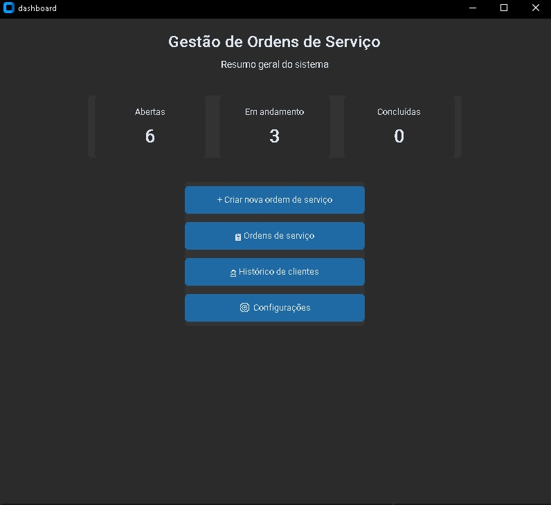

# Sistema de Gestão de Serviços

## 📌 Sobre
Sistema desenvolvido para gerenciar ordens de serviço, clientes e status.

## 🚀 Funcionalidades
- Cadastro de clientes
- Criação de ordens de serviço
- Visualização de detalhes
- Atualização de status

## 🛠️ Tecnologias
- Python
- CustomTkinter
- SQLite

## ▶️ Como rodar
```bash
pip install -r requirements.txt
python main.py
```

## 📷 Preview



