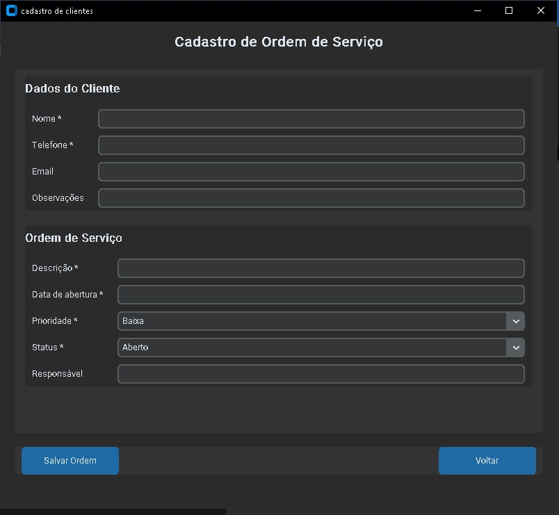
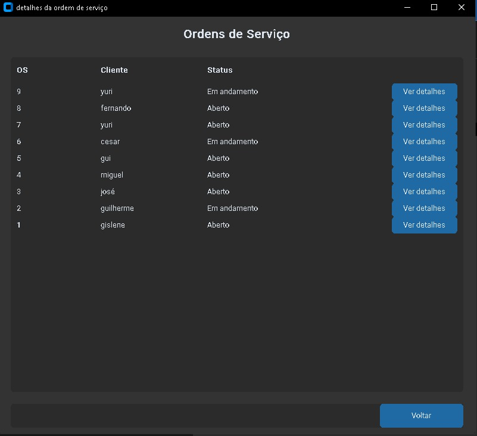

# Sistema de Gestão de Serviços

## 📌 Sobre
Sistema desenvolvido para gerenciar ordens de serviço, clientes e status.

---

## 🚀 Funcionalidades
- Cadastro de clientes
- Criação de ordens de serviço
- Visualização de detalhes
- Atualização de status

---

## 🛠️ Tecnologias
- Python
- CustomTkinter
- SQLite

---

## 📦 Instalação

```bash
git clone https://github.com/lxppe/service-management-system
cd service-management-system
pip install -r requirements.txt

## ▶️ Como rodar
python main.py

## 📷 Preview






